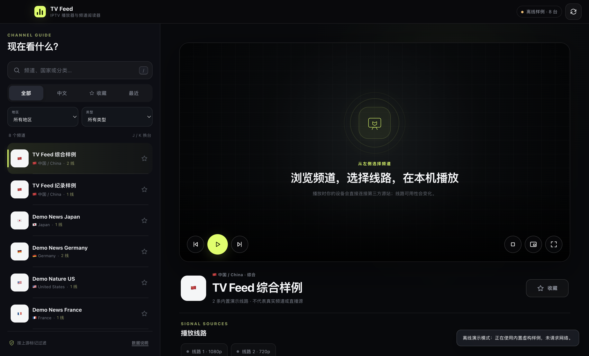

# TV Feed

TV Feed 是一个开源、本地运行的 IPTV 播放器和频道阅读器。应用运行时读取第三方公共目录，视频由用户设备直接连接第三方源站。项目不托管、代理、录制或重新分发电视内容。

TV Feed 与 iptv-org、电视台、频道及内容权利人没有隶属、赞助、背书或官方合作关系。收录目录条目不代表项目已经核实其授权状态、可用地区或持续可用性。



> 截图使用内置虚构样例频道和 TV Feed 自有占位标识，不显示实际节目画面，也不加载第三方频道 Logo。

## 功能

- 左侧频道目录、右侧直播播放器
- 按国家、地区和分类浏览与搜索
- 收藏与最近观看；数据只保存在本机
- HTTPS HLS 多线路切换，播放失败时尝试下一条线路
- 画中画、全屏和键盘换台
- 基于上游 NSFW 标记、分类和 blocklist 的保守内容过滤
- 筛除停播、未知、被屏蔽和浏览器不兼容的目录条目
- 本地目录缓存和内置离线样例
- 远程频道 Logo 默认关闭，可由用户主动开启
- 在应用内清除目录缓存、收藏和观看记录

## 频道呈现原则

- “收藏”完全由用户选择，并且只保存在用户设备上。
- 第一版只提供用户自主的“收藏”，不设置“精选”“推荐”或“官方源”等项目背书标签。

## 开发

```bash
npm install
npm run dev
```

## 验证

```bash
npm run typecheck
npm test
npm run build
npm run smoke
```

`npm run smoke` 会使用内置虚构样例目录真实启动 Electron、检查主要界面状态，并将截图写入系统临时目录。样例线路使用保留的 `.invalid` 域名，不代表任何真实频道或直播源。

公开 README 截图必须通过离线样例模式生成，不要使用 `TVFEED_SMOKE_LIVE=1` 或 `TVFEED_SMOKE_PLAY=1`：

```bash
TVFEED_SMOKE_OUTPUT="$PWD/docs/assets/tv-feed-offline-sample.png" npm run smoke
```

若要用 iptv-org 在线目录（或已写入的真实缓存）执行同一套验收：

```bash
TVFEED_SMOKE_LIVE=1 npm run smoke
```

如需额外尝试当前选中频道的真实 HLS 播放（会连接第三方直播源）：

```bash
TVFEED_SMOKE_LIVE=1 TVFEED_SMOKE_PLAY=1 npm run smoke
```

## macOS 开发包

```bash
npm run pack:mac
```

产物位于 `release/mac-arm64/TV Feed.app`。该脚本生成未签名的本地开发包，不代表已完成 Apple 签名、公证或公开发行。

## 数据与内容边界

- 频道元数据和直播 URL 索引来自第三方项目 [iptv-org](https://github.com/iptv-org/iptv)。
- 只有用户选择播放频道后，用户设备才会直接连接对应的第三方直播源站；TV Feed 不通过项目服务器转发视频。
- TV Feed 不托管、代理、录制、下载、归档或重新分发电视内容。本机缓存仅用于保存经过筛选的目录元数据，不建立节目媒体库。
- 只接受能关联到明确频道、`is_nsfw === false`、未停播且未进入上游 blocklist 或项目 denylist 的频道。
- 成人内容过滤依赖上游元数据，不识别直播画面；上游误标、直播内容变化或源站替换仍可能造成遗漏。
- 只接受 HTTPS HLS，且排除要求自定义 Referer 或 User-Agent 的线路。
- “筛选后频道”和“候选线路”只代表目录数据符合应用规则，不代表已从用户所在地区核实其授权状态、来源真实性或实际可用性。
- 第三方节目和直播内容的权利不属于本项目；使用时应遵守所在地区的法律和源站规则。

## 公开仓库说明

- TV Feed 自有代码和原创素材采用 [MIT License](LICENSE)。该许可不覆盖第三方频道目录、直播内容、频道名称、Logo、商标或第三方软件。
- 第三方软件及打包所需版权声明见 [THIRD_PARTY_NOTICES.md](THIRD_PARTY_NOTICES.md)。
- 项目定位、内容边界、访问控制政策和权利移除流程见 [LEGAL.md](LEGAL.md)。
- 本地数据、第三方网络连接和用户清除入口见 [PRIVACY.md](PRIVACY.md)。
- 安全问题的私下报告方式和支持范围见 [SECURITY.md](SECURITY.md)。
- 频道、直播链接、Logo 或商标的移除申请请使用 [权利移除申请模板](.github/ISSUE_TEMPLATE/rights-removal.yml)，不要在公开 Issue 中上传身份证明、合同、私人 Token 或其他非公开资料。
